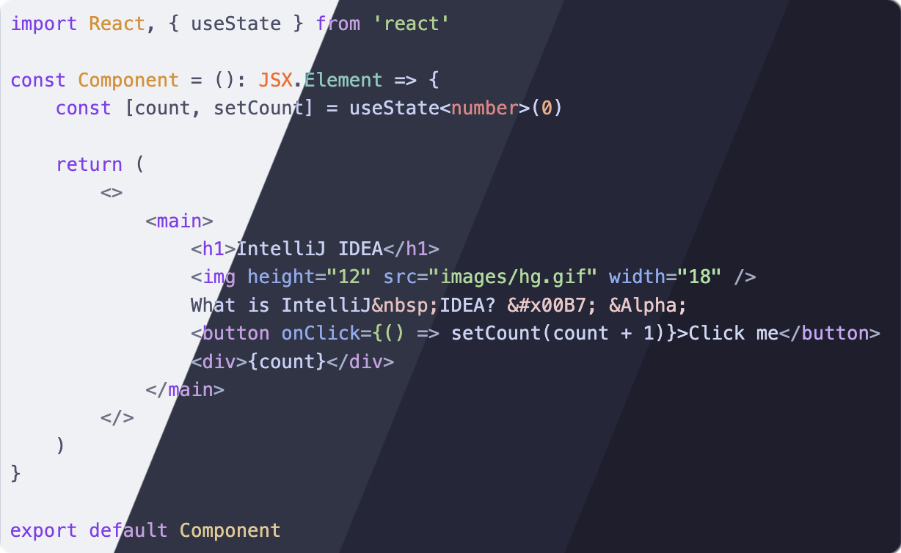
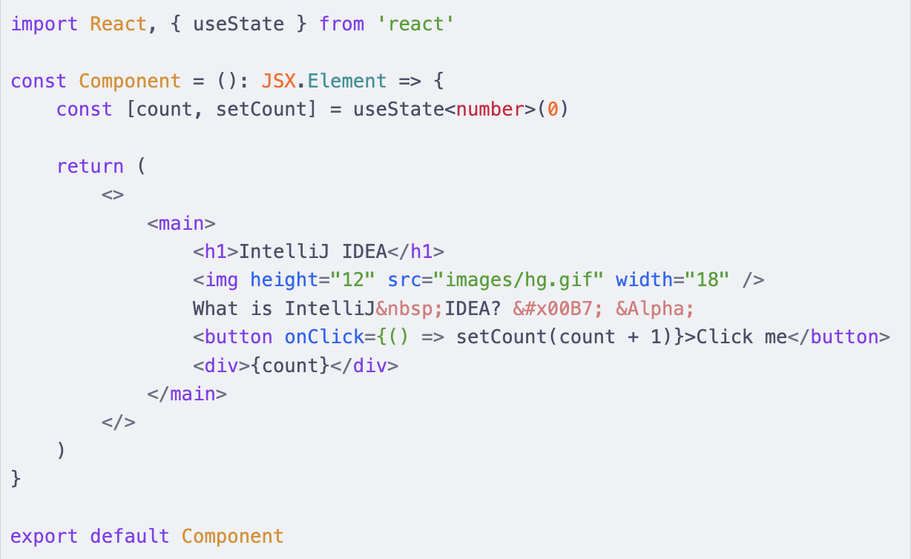
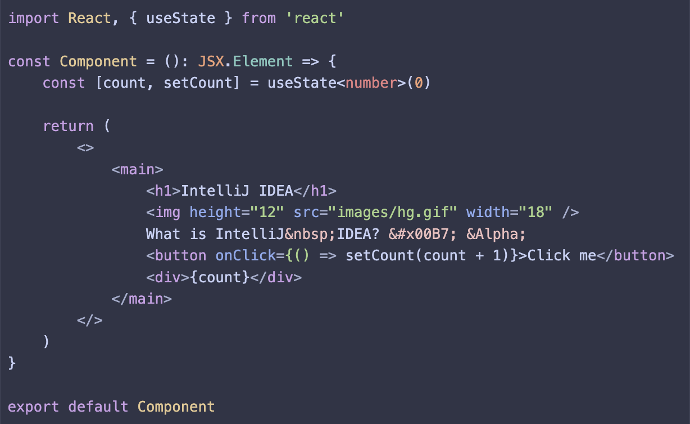
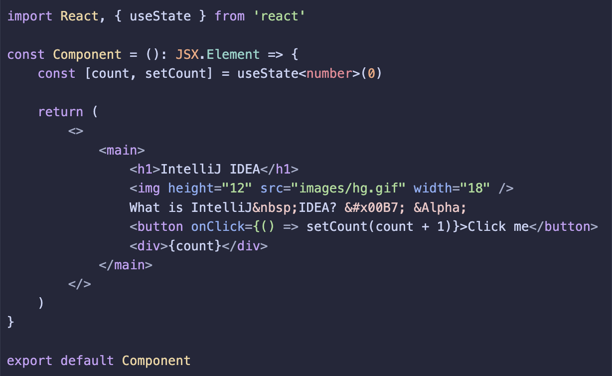
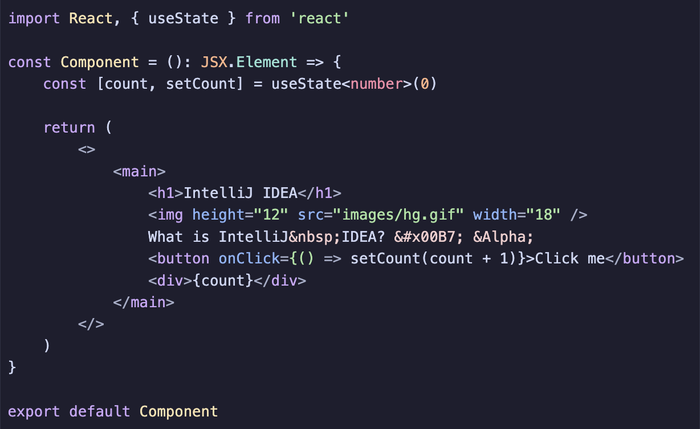

<h3 align="center">
	<br/>
	
	Catppuccin for <a href="https://github.com/highlightjs/highlight.js">Highlight.js</a>
	
</h3>

<p align="center">
	<a href="https://github.com/catppuccin/highlightjs/stargazers"></a>
	<a href="https://github.com/catppuccin/highlightjs/issues"></a>
	<a href="https://github.com/catppuccin/highlightjs/contributors"></a>
</p>

<p align="center">
	
</p>

## Previews

<details>
<summary>🌻 Latte</summary>

</details>
<details>
<summary>🪴 Frappé</summary>

</details>
<details>
<summary>🌺 Macchiato</summary>

</details>
<details>
<summary>🌿 Mocha</summary>

</details>

## Usage

Add the CSS for your preferred flavor in your markup. You can do this by either getting the files from npm, or through a CDN.

### npm

Install the `@catppuccin/highlightjs` package with your preferred package manager.

```bash
npm install -D @catppuccin/highlightjs
```

You can then use the files in `@catppuccin/highlightjs/css` or `@catppuccin/highlightjs/sass`.

### CDN

Embed the [Highlight.js script](https://highlightjs.org/download/) along with one of our themes.

> [!NOTE]
> The "variable version" assumes that you have a flavor of Catppuccin already present in your CSS variables, in the format of three comma separated RGB
> values (e.g. `:root { --ctp-mauve: 136,57,239; }`). This is particularly useful if you use [Catppuccin TailwindCSS](https://github.com/catppuccin/tailwindcss).

<!-- x-release-please-start-version -->

#### unpkg

```html
<link rel="stylesheet" href="//unpkg.com/@catppuccin/highlightjs@0.2.2/css/catppuccin-latte.css">
<link rel="stylesheet" href="//unpkg.com/@catppuccin/highlightjs@0.2.2/css/catppuccin-frappe.css">
<link rel="stylesheet" href="//unpkg.com/@catppuccin/highlightjs@0.2.2/css/catppuccin-macchiato.css">
<link rel="stylesheet" href="//unpkg.com/@catppuccin/highlightjs@0.2.2/css/catppuccin-mocha.css">
<!-- variable (rgb format) version -->
<link rel="stylesheet" href="//unpkg.com/@catppuccin/highlightjs@0.2.2/css/catppuccin.variables.css">
<link rel="stylesheet" href="//unpkg.com/@catppuccin/highlightjs@0.2.2/css/catppuccin.variables.important.css">
<!-- variable (any format) version -->
<link rel="stylesheet" href="//unpkg.com/@catppuccin/highlightjs@0.2.2/css/catppuccin.variables.any.css">
<link rel="stylesheet" href="//unpkg.com/@catppuccin/highlightjs@0.2.2/css/catppuccin.variables.any.important.css">
```

#### jsDelivr

```html
<link rel="stylesheet" href="//cdn.jsdelivr.net/npm/@catppuccin/highlightjs@0.2.2/css/catppuccin-latte.css">
<link rel="stylesheet" href="//cdn.jsdelivr.net/npm/@catppuccin/highlightjs@0.2.2/css/catppuccin-frappe.css">
<link rel="stylesheet" href="//cdn.jsdelivr.net/npm/@catppuccin/highlightjs@0.2.2/css/catppuccin-macchiato.css">
<link rel="stylesheet" href="//cdn.jsdelivr.net/npm/@catppuccin/highlightjs@0.2.2/css/catppuccin-mocha.css">
<!-- variable (rgb format) version -->
<link rel="stylesheet" href="//cdn.jsdelivr.net/npm/@catppuccin/highlightjs@0.2.2/css/catppuccin.variables.css">
<link rel="stylesheet" href="//cdn.jsdelivr.net/npm/@catppuccin/highlightjs@0.2.2/css/catppuccin.variables.important.css">
<!-- variable (any format) version -->
<link rel="stylesheet" href="//cdn.jsdelivr.net/npm/@catppuccin/highlightjs@0.2.2/css/catppuccin.variables.any.css">
<link rel="stylesheet" href="//cdn.jsdelivr.net/npm/@catppuccin/highlightjs@0.2.2/css/catppuccin.variables.any.important.css">
```

<!-- x-release-please-end -->

## 💝 Thanks to

- [Andreas Grafen](https://github.com/andreasgrafen)
- [winston](https://github.com/nekowinston)

&nbsp;

<p align="center">
	
</p>

<p align="center">
	Copyright &copy; 2021-present <a href="https://github.com/catppuccin" target="_blank">Catppuccin Org</a>
</p>

<p align="center">
	<a href="https://github.com/catppuccin/catppuccin/blob/main/LICENSE"></a>
</p>
